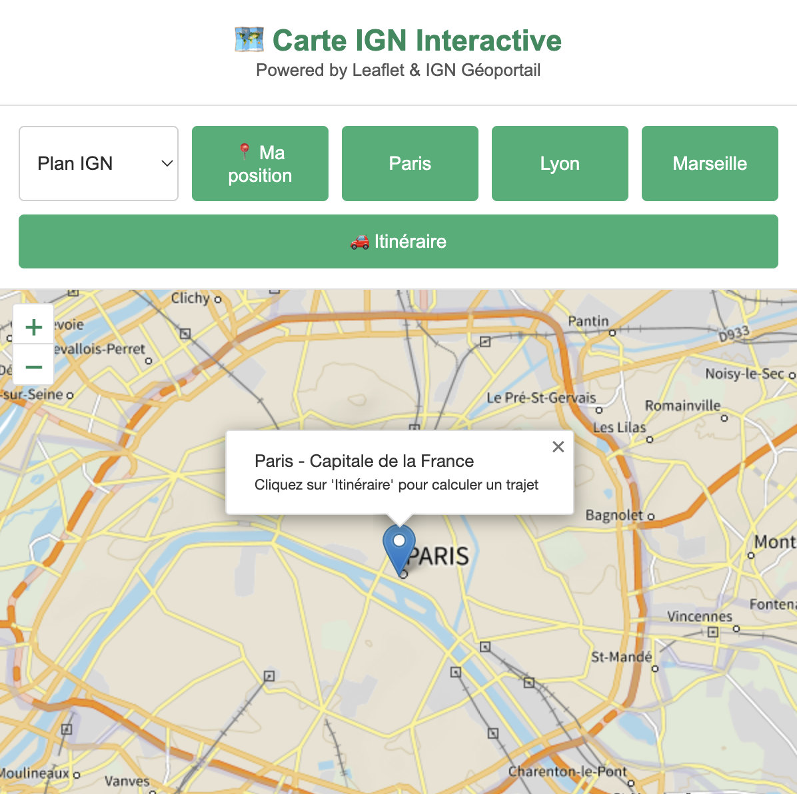
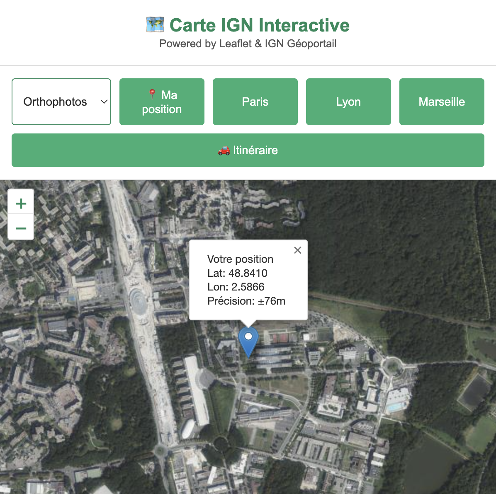
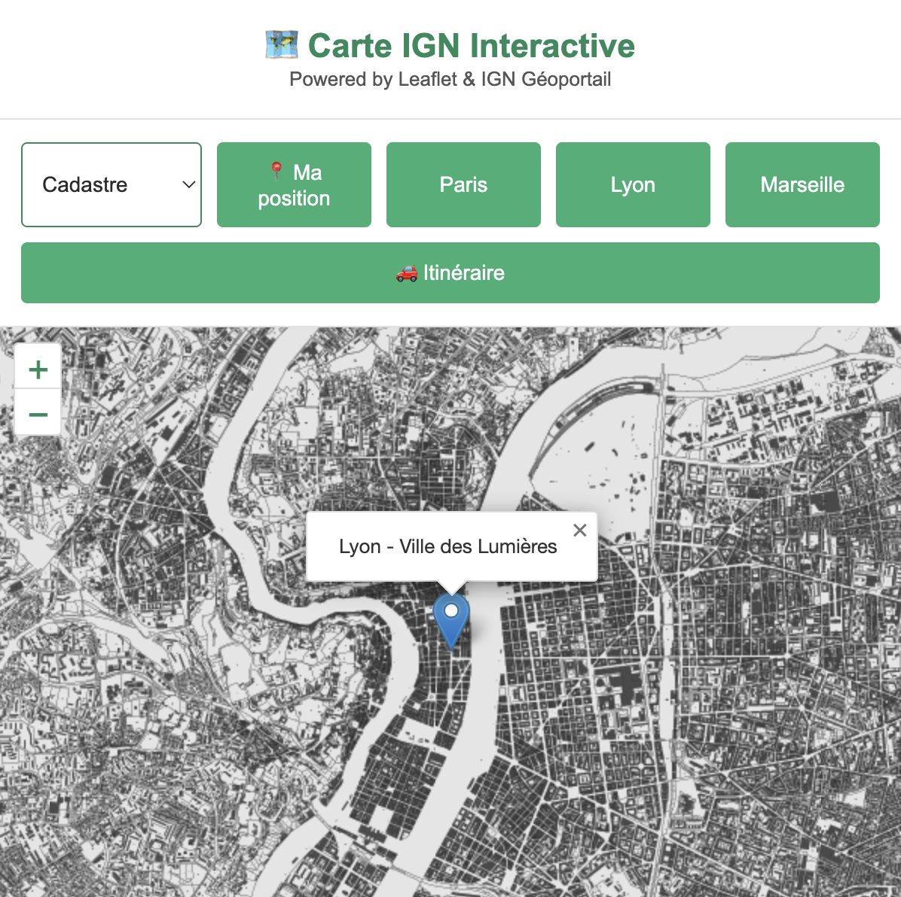

# 🗺️ Extension Chrome - Carte Interactive IGN

> Projet scolaire démontrant l'intégration d'une carte interactive Leaflet consommant un service web de l'IGN dans une extension Chrome.

[](https://developer.chrome.com/docs/extensions/)
[](https://leafletjs.com/)
[](https://www.ign.fr/)

---

## 📌 Objectif du projet

**Question de recherche :** Est-il possible d'afficher une carte interactive dans une extension Chrome ?

**Réponse :** Oui ! Ce projet démontre qu'il est tout à fait possible d'intégrer une carte interactive complète dans une extension Chrome en utilisant :
- La bibliothèque **Leaflet.js**
- Les services cartographiques de l'**IGN** (Institut national de l'information géographique et forestière)
- Le protocole **WMTS** (Web Map Tile Service)

---

## ✨ Fonctionnalités

  * 🗺️ **Carte interactive** : Zoom, déplacement, navigation fluide
  * 🇫🇷 **Fonds de carte IGN sélectionnables** : Choisissez entre Plan IGN V2, Orthophotographie et Parcelles Cadastrales.
  * 🚗 **Calcul d'itinéraires** : Intégration OSRM pour le routage (voiture, vélo, marche) avec affichage d'alternatives.
  * 📍 **Géocodage** : Recherche d'adresses textuelles (Départ/Arrivée) via l'API Nominatim.
  * 📍 **Géolocalisation** : Centrage automatique sur votre position actuelle (avec autorisation de Chrome).
  * 📍 **Navigation rapide** : Boutons vers Paris, Lyon, Marseille
  * 🖱️ **Marqueurs interactifs** : Placement de marqueur au clic et sélection de points d'itinéraire A/B.
  * 📊 **Informations temps réel** : Coordonnées et niveau de zoom actualisés


---

## 📸 Aperçu

| Vue Principale | Fond Orthophoto (Paris) | Fond Cadastre (Marseille) |
| :---: | :---: | :---: |
|  |  |  |
| *L'extension lors de son ouverture.* | *Aperçu de la vue Orthophotographie.* | *Aperçu de la vue Cadastrale.* |

---

## 🚀 Installation rapide

### Prérequis

  - Google Chrome (version 88+)
  - Connexion Internet

### Étapes

1.  **Télécharger le projet**

    ```bash
    # Cloner ou télécharger le dossier complet : https://github.com/MaelQllt/ExtensionChrome.git
    ```

2.  **Créer les icônes**

      - Placez 3 icônes PNG dans le dossier `icons/` :
          - `icon16.png` (16×16 pixels)
          - `icon48.png` (48×48 pixels)
          - `icon128.png` (128×128 pixels)

3.  **Charger l'extension**

      - Ouvrez Chrome : `chrome://extensions/`
      - Activez le "**Mode développeur**"
      - Cliquez "**Charger l'extension non empaquetée**"
      - Sélectionnez le dossier du projet

4.  **Utiliser l'extension**

      - Cliquez sur l'icône de l'extension dans la barre d'outils
      - La carte s'affiche dans un popup

Vous pouvez consultez la [documentation d'installation complète](docs/installation.md#installation).

-----

## ⚠️ Notes d'utilisation et Dépannage

### Problème de Géolocalisation

Si le bouton **"📍 Ma position"** ne fonctionne pas et affiche un message d'erreur **"Accès à la position refusé"** (Code `PERMISSION_DENIED`) :

1.  L'extension a besoin d'une permission temporaire de Chrome pour la géolocalisation.
2.  Cliquez sur l'icône de **Cadenas (🔒)** dans la barre d'adresse du navigateur.
3.  Autorisez l'accès à la **"Position"** pour cette extension.
4.  Le script JavaScript interne gère et affiche cette instruction en cas de refus.


-----

## 🛠️ Technologies utilisées

| Technologie | Version | Rôle |
|-------------|---------|------|
| Chrome Extension API | Manifest V3 | Framework d'extension |
| Leaflet.js | 1.9.4 | Bibliothèque cartographique |
| IGN Géoportail | WMTS | Service de tuiles |
| HTML5 / CSS3 | - | Interface utilisateur |
| JavaScript | ES6+ | Logique métier |

-----

## 🔧 Configuration technique

### Services IGN (WMTS)

Trois couches sont utilisées :

1.  **Plan IGN** : `GEOGRAPHICALGRIDSYSTEMS.PLANIGNV2`
2.  **Orthophoto** : `ORTHOIMAGERY.ORTHO-HR`
3.  **Cadastre** : `CADASTRALPARCELS.PARCELS`

### Nouveaux services d'API

  * **Routage :** `https://router.project-osrm.org/*` (OSRM)
  * **Géocodage :** `https://nominatim.openstreetmap.org/*` (Nominatim)

### Permissions requises

  - `storage` : Stockage local (prévu pour futures fonctionnalités)
  - **`geolocation`** : Accès à la position de l'utilisateur (nécessaire pour la géolocalisation)
  - Host : `https://data.geopf.fr/*` (accès aux tuiles IGN)
  - Host : `https://router.project-osrm.org/*` (Routage OSRM)
  - Host : `https://nominatim.openstreetmap.org/*` (Géocodage Nominatim)

-----

## 👨‍💻 Documentation programmeur

Pour comprendre le fonctionnement interne, l'architecture et les API utilisées, consultez la [documentation programmeur complète](docs/programmeur.md#programmeur).

**Sujets couverts (Mis à jour) :**

  - Architecture de l'extension (gestion des options de fond de carte, panneau d'itinéraire)
  - Détail de chaque fichier
  - API Leaflet, gestion des couches (`L.tileLayer`) et dessin de polylignes (`L.polyline`)
  - Utilisation de l'API `navigator.geolocation` et gestion des erreurs
  - Intégration des APIs OSRM et Nominatim
  - Gestion de la sécurité (CSP)
  - Guide d'amélioration et Debugging

-----


## 📚 Ressources

### Documentation officielle

  - [Leaflet - Documentation](https://leafletjs.com/reference.html)
  - [IGN - Géoservices](https://geoservices.ign.fr/documentation/)
  - [Chrome Extensions - Guide](https://developer.chrome.com/docs/extensions/mv3/)

### Standards utilisés

  - [WMTS - OGC Standard](https://www.ogc.org/standards/wmts)
  - [Manifest V3 - Chrome](https://developer.chrome.com/docs/extensions/mv3/intro/)

-----

## 👤 Auteur

**Maël QUILLAT** Projet scolaire - ENSG Carthagéo 2025-2026

-----

## 📄 Licence

Ce projet est réalisé dans un cadre éducatif.

**Crédits :**

  - Cartes : © [IGN](https://www.ign.fr/) - Géoportail
  - Bibliothèque : [Leaflet](https://leafletjs.com/) (BSD 2-Clause License)

-----

## 🎓 Contexte académique

Ce projet répond à un exercice scolaire visant à :

1.  Démontrer la faisabilité d'une carte interactive dans une extension
2.  Consommer plusieurs services web (WMTS de l'IGN, OSRM, Nominatim)
3.  Intégrer la géolocalisation
4.  Produire une documentation complète (installation + programmeur)
5.  Fournir des visuels de démonstration

-----